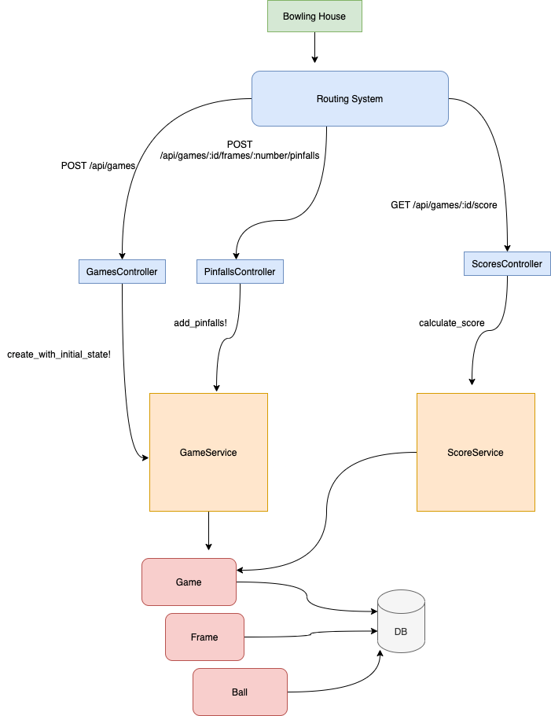

# README

## Intro
This application provides a basic API for managing bowling games. Currently, three endpoints are exposed:
- `POST /api/games` creates a new game
- `POST /api/games/:id/frames/:number/pinfalls {ball_number:, pinfalls:}` Registers the amount of pins knocked by a ball delivery
- `GET /api/games/:id/score` returns the score of the game detailed by frame

## Architecture Overview
The application is structured around two services, `GameService` and `ScoreService` that encapsulate the writing and reading flow respectively.
`GameService` is responsible for validating the game aggregate, validating any changes requested by the client.
`ScoreService` is responsible for calculating the score of any given game, currently using [traditional scoring rules](https://en.wikipedia.org/wiki/Ten-pin_bowling#Scoring).
The data model is supposed to be as agnostic as possible, avoiding any domain related validations. This way it's possible to change the game rules without having to worry about the data model.



## Setup
`docker-compose build` This will already start the service at localhost:3000

`docker-compose up -b`

`docker-compose run web rails db:create`

`docker-compose run web rails db:migrate`

### running tests
`docker-compose run web bundle exec rspec`


## Usage with curl
### creating a game
```
curl -X POST 'localhost:3000/api/games/' | jq .
```

### adding pinfalls
```
curl -X POST 'localhost:3000/api/games/914fc212-174d-4847-bb53-d88135bebf84/frames/1/pinfalls' -d '{"ball_number": 1, "pinfalls": 9}' -H "Content-Type: application/json" -v
```

### consulting the score
```
curl -X GET 'localhost:3000/api/games/914fc212-174d-4847-bb53-d88135bebf84/score' | jq .

```
